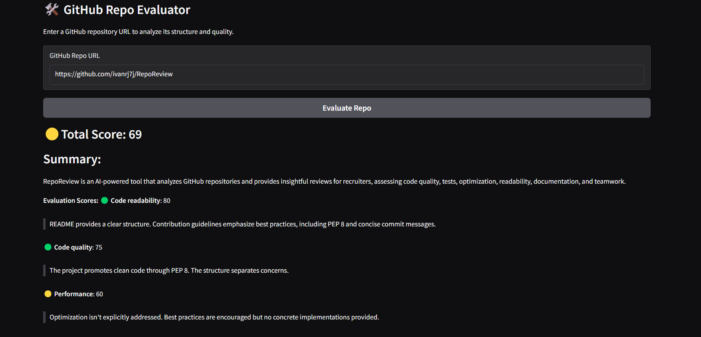

# RepoReview 🤖📊  

🔗 **Live Demo:** [RepoReview on Render](https://reporeview.onrender.com)  

Welcome to **RepoReview**, an AI-powered tool designed to analyze GitHub repositories and generate insightful reviews for recruiters and developers. This tool helps assess **coding quality, documentation, and best practices** in open-source projects.  

  

## 📌 Project Overview  

RepoReview evaluates a GitHub repository based on multiple factors, including:  

- ✅ **Testing** – Checks for unit and integration tests.  
- 🏗️ **Code Quality** – Analyzes structure, maintainability, and efficiency.  
- ⚡ **Optimization** – Identifies performance bottlenecks.  
- 📖 **Readability** – Reviews naming conventions, comments, and clarity.  
- 📚 **Documentation** – Evaluates README, docstrings, and guides.  
- 👥 **Collaboration Metrics** – Assesses commit history, PRs, and teamwork.  

## 🚀 Features  

- **🔎 AI-Powered Analysis:** Uses NLP and ML to generate detailed repo reviews.  
- **📊 Interactive Reports:** Provides structured insights on coding practices.  
- **🎨 User-Friendly UI:** Built with Gradio for seamless user interaction.  
- **📡 Hosted Online:** Accessible via a simple web interface.  

## 🏗️ Project Structure  

📂 **.github/** - CI/CD workflows for automation.  
📂 **docs/** - Documentation and references.  
📂 **src/** - Source code for AI review components.  
📂 **tests/** - Unit tests ensuring AI model accuracy.  
📄 **.gitignore** - Files excluded from version control.  
📜 **LICENSE** - Open-source licensing details.  
📘 **README.md** - Project documentation.  
📋 **requirements.txt** - List of dependencies.  
🐍 **test.py** - Test script for AI evaluation.  

## 🛠️ Getting Started  

1. **Clone the repository:**  
   ```bash
   git clone https://github.com/ivanrj7j/RepoReview.git
   cd RepoReview
   ```  
2. **(Optional) Create a virtual environment:**  
   ```bash
   python -m venv venv  
   source venv/bin/activate  # Windows: `venv\Scripts\activate`
   ```  
3. **Install dependencies:**  
   ```bash
   pip install -r requirements.txt  
   ```  
4. **Run the application locally:**  
   ```bash
   python main.py  
   ```  

## ✅ Project Status: Completed  

RepoReview is now **fully functional and live**. Future enhancements may include:  

- 🤖 **Improved AI Model:** Enhancing accuracy and scoring algorithms.  
- 🌐 **Multi-Language Support:** Extending analysis to non-Python repositories.  
- 📢 **User Feedback Integration:** Allowing recruiters to provide input on AI-generated reports.  

🚀 **Check it out live:** [RepoReview on Render](https://reporeview.onrender.com)